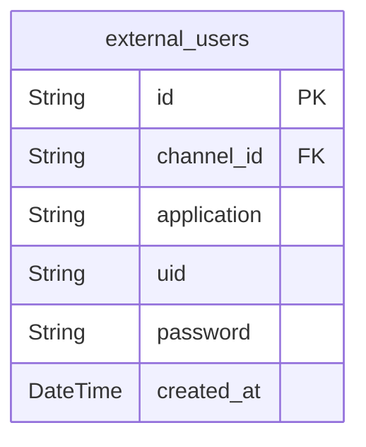
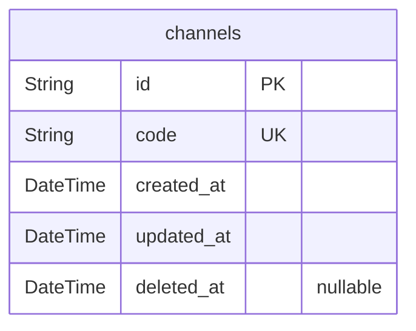
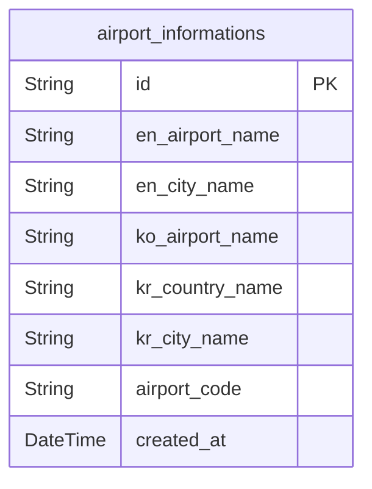
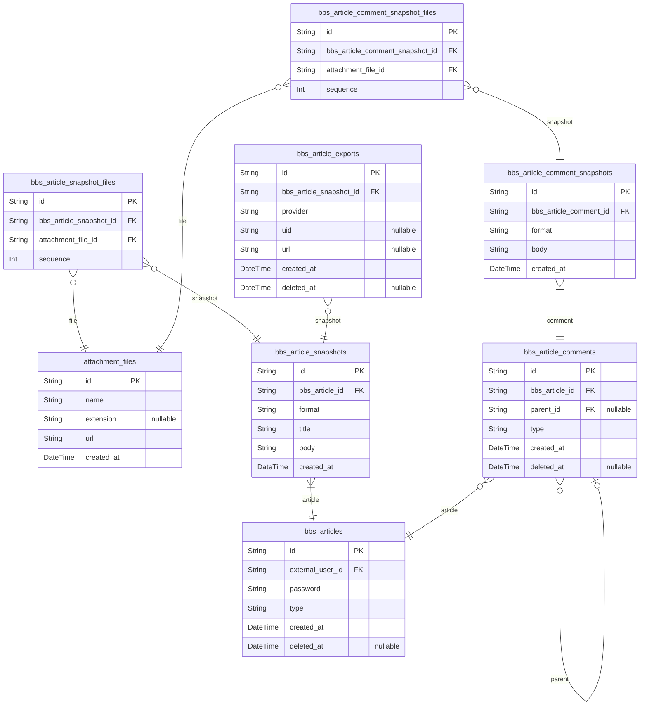
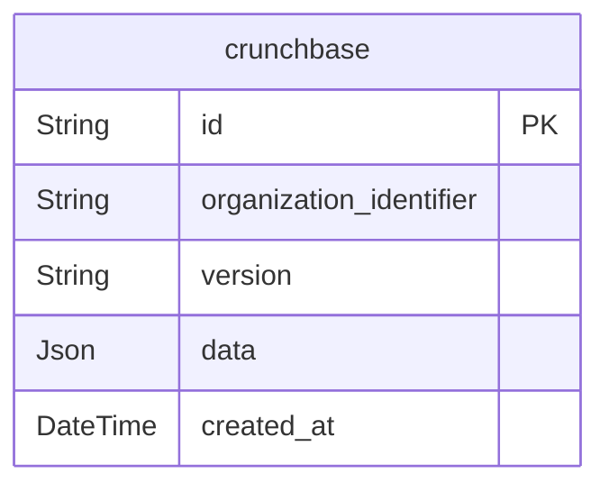
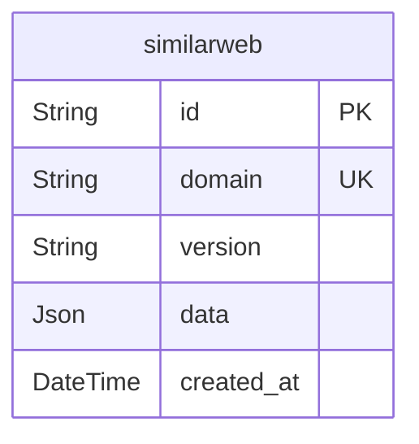
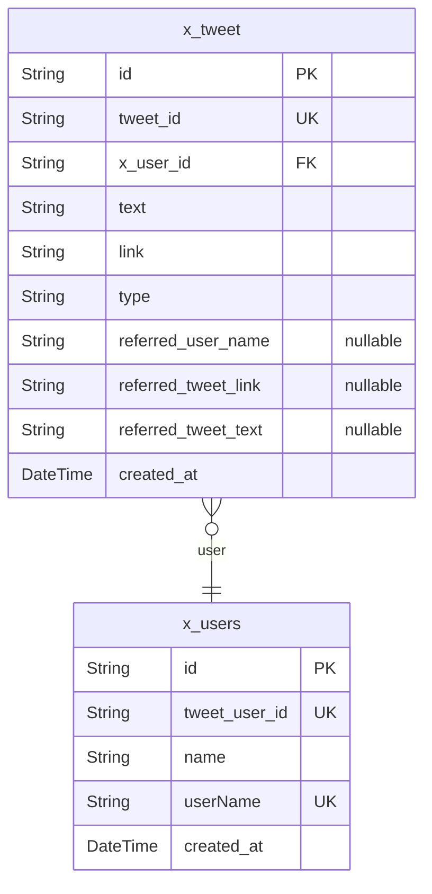
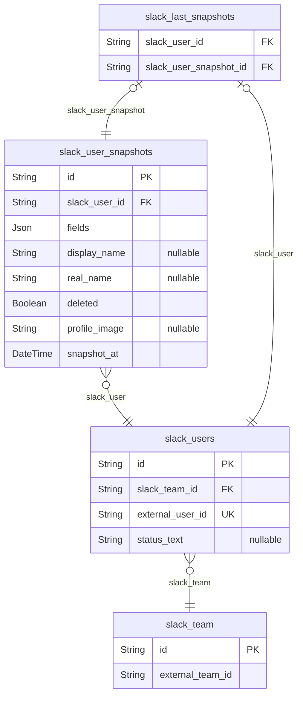

# Prisma Markdown
> Generated by [`prisma-markdown`](https://github.com/samchon/prisma-markdown)

- [Actors](#actors)
- [Systematic](#systematic)
- [AirportInformations](#airportinformations)
- [Articles](#articles)
- [Crunchbase](#crunchbase)
- [Similarweb](#similarweb)
- [X](#x)
- [SaleContents](#salecontents)
- [Audits](#audits)
- [Inquiries](#inquiries)
- [Issues](#issues)
- [default](#default)

## Actors

### `external_users`
External user information.

An entity for when this system is linked to an external service and 
their users are accepted as customers of this service.

And `password` is a password issued to the user by the external service system
(so-called user permanent authentication token), and is never an actual user 
password. However, it is used to determine whether a customer who entered the 
same `application` and `uid` as the current external system user is 
a correct external system user or a violation.

In addition, additional information received from external services can be 
recorded in the `data` field in JSON format.

**Properties**
  - `id`: 
  - `channel_id`: [channels.id](#channels) of the affiliated channel
  - `application`
    > The identifier code of the external service.
    > 
    > It is most likely the same as [channels.code](#channels).
  - `uid`: An identifier key for that user in an external service.
  - `password`
    > System password for external service users.
    > 
    > This is a password issued by the external service to the user, 
    > and is never the actual user password. However, it is used to determine 
    > whether a customer who entered the same `application` and `code` as the 
    > current external system user is considered a valid external system user 
    > or a violation.
  - `created_at`: Record creation date and time (first external user authentication date and time)

## Systematic

### `channels`
channel information.

**Properties**
  - `id`: 
  - `code`: Identifier code.
  - `created_at`: The date and time the record was created.
  - `updated_at`: Date and time of record edit.
  - `deleted_at`: Date and time of record deletion.

## AirportInformations

### `airport_informations`
Airport information from around the world.

**Properties**
  - `id`: Primary Key.
  - `en_airport_name`: Airport Name in English.
  - `en_city_name`: City Name in English.
  - `ko_airport_name`: Airport Name in Korean.
  - `kr_country_name`: Country Name in Korean.
  - `kr_city_name`: City Name in Korean.
  - `airport_code`: Airport Code.
  - `created_at`: The date and time the record was created.

## Articles

### `attachment_files`
Attachments.

Attachment entities used everywhere in this DB.

**Properties**
  - `id`: 
  - `name`: File name, excluding extension.
  - `extension`: Extension.
  - `url`: URL path to the file.
  - `created_at`: The date and time the record was created.

### `bbs_articles`
Article entity.

`bbs_articles` is a entity for all types of articles existing 
in the current exchange system, and literally embodies individual articles 
on the bulletin board.

And elements such as titles and texts that must exist in articles do not exist 
in this `bbs_articles`, but exist in a 1:N relationship in the lower entity, 
[bbs_article_snapshots](#bbs_article_snapshots), because a new snapshot record is issued every time 
an article is modified.

And disputes can arise through articles or comments on them, and in this case, 
articles are designed in this structure to prevent manipulation of the situation 
by modifying existing articles.

To prevent so-called 'undercutting', keeping evidence and preventing fraud.

**Properties**
  - `id`: 
  - `external_user_id`: External User ID
  - `password`
    > System Password
    > 
    > This is a randomly issued password for encryption by
    > this system, and has absolutely nothing to do with the user.
  - `type`: The type of subtype.
  - `created_at`: The date and time the article was created.
  - `deleted_at`: Date and time of article deletion.

### `bbs_article_snapshots`
Article Snapshots

`bbs_article_snapshots` is a snapshot entity that contains the content of 
an article. As explained in [bbs_articles](#bbs_articles), the content is separated 
from the article record to prevent undercutting.

**Properties**
  - `id`: Primary Key.
  - `bbs_article_id`: [bbs_articles.id](#bbs_articles) of the attached article
  - `format`
    > Format of the body.
    > 
    > Similar meanings of extensions: html, md, txt, etc.
  - `title`: Title of the article
  - `body`: Article body content
  - `created_at`
    > Record creation date.
    > 
    > When the article was first created or edited.

### `bbs_article_snapshot_files`
Attachment files of article snapshots.

`bbs_article_snapshot_files` is an entity that visualizes attachment files 
of article snapshots.

`bbs_article_snapshot_files` is a typical pair relationship table that 
resolves the M: N relationship between [bbs_article_snapshots](#bbs_article_snapshots) and
[attachment_files](#attachment_files). And to ensure the order of attachment files, it has 
an additional property, [bbs_article_snapshot_files.sequence](#bbs_article_snapshot_files). 

This is a pattern that we will continue to see in the future, so let's get 
used to it in advance.

**Properties**
  - `id`: 
  - `bbs_article_snapshot_id`: [bbs_article_snapshots.id](#bbs_article_snapshots) of the attributed article snapshot
  - `attachment_file_id`: [attachment_files.id](#attachment_files)
  - `sequence`: The order in which attachments are placed in the article snapshot.

### `bbs_article_comments`
Comments written on an article.

`bbs_article_comments` is an entity that visualizes comments written on an article.

And this comment, as in the relationship between [bbs_articles](#bbs_articles) 
and [bbs_article_snapshots](#bbs_article_snapshots), is stored in the subordinate
[bbs_article_comment_snapshots](#bbs_article_comment_snapshots) for evidentialism, and a new snapshot 
record is issued whenever a comment is modified.

In addition, the relationship between replies is expressed through the 
[bbs_article_comments.parent_id](#bbs_article_comments) property.

**Properties**
  - `id`: 
  - `bbs_article_id`: [bbs_articles.id](#bbs_articles) of the attached article.
  - `parent_id`
    > The ID of the parent comment.
    > 
    > Used when writing a reply.
  - `type`: The type of subtype.
  - `created_at`: Comment creation date and time.
  - `deleted_at`: Comment deletion date and time.

### `bbs_article_comment_snapshots`
Comment snapshots.

`bbs_article_comment_snapshots` is a snapshot entity that contains 
the main content of the comment.

As explained in [bbs_article_comments](#bbs_article_comments) above, to prevent undercutting.

**Properties**
  - `id`: 
  - `bbs_article_comment_id`: [bbs_article_comments.id](#bbs_article_comments) of the comment on the attached article.
  - `format`
    > Format of the body.
    > 
    > Similar meanings of extensions: html, md, txt, etc.
  - `body`: Comment body.
  - `created_at`: Record creation date and time (when the comment was first created or edited)

### `bbs_article_comment_snapshot_files`
Attachments to comment snapshots.

[bbs_article_comment_snapshots](#bbs_article_comment_snapshots) [attachment_files](#attachment_files)

M: N relationship resolution.

**Properties**
  - `id`: 
  - `bbs_article_comment_snapshot_id`: [bbs_article_comment_snapshots.id](#bbs_article_comment_snapshots) of the attributed comment snapshot
  - `attachment_file_id`: [attachment_files.id](#attachment_files)
  - `sequence`
    > Batch order.
    > 
    > The order in which the files attached to the comment snapshot are placed.

### `bbs_article_exports`

**Properties**
  - `id`: 
  - `bbs_article_snapshot_id`: [bbs_article_snapshots.id](#bbs_article_snapshots) of the attributed article snapshot
  - `provider`
    > Meaning of the name of the external service
    > 
    > For example, google_docs, notion
  - `uid`: Unique ID of this exported document
  - `url`: URL path to the reference
  - `created_at`: The date and time the record was created.
  - `deleted_at`: Date and time of article deletion.

## Crunchbase

### `crunchbase`
Get company information using the Crunchbase Rapid API.

**Properties**
  - `id`: Primary Key.
  - `organization_identifier`: Organization Identifier.
  - `version`
    > Api Version.
    > 
    > Rapid API Version.
    > We store the API version at the time of record created, as changes to the API version may affect the API.
  - `data`
    > Response Data
    > 
    > The data returned by the API.
    > Since the format of the response data depends on an external API and it is difficult to determine the type, it is saved as JSON type.
  - `created_at`: The date and time the record was created.

## Similarweb

### `similarweb`
Get information using the Similarweb Rapid API.

**Properties**
  - `id`: Primary Key.
  - `domain`: The domain of the company website.
  - `version`
    > Api Version.
    > 
    > Rapid API Version.
    > We store the API version at the time of record created, as changes to the API version may affect the API.
  - `data`
    > Response Data
    > 
    > The data returned by the API.
    > Since the format of the response data depends on an external API and it is difficult to determine the type, it is saved as JSON type.
  - `created_at`: The date and time the record was created.

## X

### `x_users`
The user information of X.

**Properties**
  - `id`: Primary Key.
  - `tweet_user_id`: Unique ID of the user in X.
  - `name`: Original name of the user.
  - `userName`: Username used like a nickname in X.
  - `created_at`: The date and time the record was created.

### `x_tweet`
The tweet information of X.

**Properties**
  - `id`: Primary Key.
  - `tweet_id`: Unique Id of the tweet in X.
  - `x_user_id`: Unique user ID of the user who posted the tweet.
  - `text`: The text of the tweet.
  - `link`: The URL of the tweet.
  - `type`: The type of the tweet.
  - `referred_user_name`: Author name of the tweet you quoted or retweeted.
  - `referred_tweet_link`: Link to the tweet you quoted or retweeted.
  - `referred_tweet_text`: Text of the tweet you quoted or retweeted.
  - `created_at`: The date and time the record was created.

## default

### `slack_team`

**Properties**
  - `id`: Unique ID of the team in Studio-Pro
  - `external_team_id`: Unique ID of the team in Slack

### `slack_users`

**Properties**
  - `id`: Unique ID of the user in Studio-Pro
  - `slack_team_id`: 
  - `external_user_id`: Unique ID of the user in Slack
  - `status_text`: 유저의 상태 값

### `slack_user_snapshots`

**Properties**
  - `id`: 
  - `slack_user_id`: slack_users.id를 의미한다.
  - `fields`: 슬랙 내에서 `Record<string, string>` 형태로 관리되는 여러 정보들
  - `display_name`: 
  - `real_name`: 
  - `deleted`: 
  - `profile_image`: 
  - `snapshot_at`: 마지막으로 조회한 시간을 의미하며, 데이터가 유효하다고 믿을 수 있는 마지막 시간을 의미

### `slack_last_snapshots`

**Properties**
  - `slack_user_id`: 
  - `slack_user_snapshot_id`: 